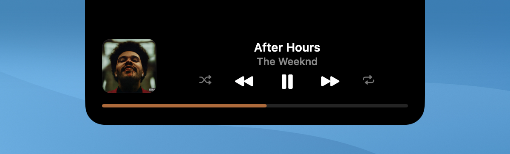

# LightNotch

A small macOS app that turns the MacBook notch into a mini player for Spotify.

<p align="center">
  
  
</p>

While a song is playing, the notch stretches out to show the album cover on one side and an equalizer that moves with the music on the other. Click it to open a player with the track, the artist, playback controls, shuffle, repeat and a progress bar you can click or drag to jump around. Clicking the cover brings Spotify to the front.

## Requirements

- macOS 14 or later on Apple silicon
- Xcode Command Line Tools (`xcode-select --install`)
- The Spotify desktop app

## Install

```bash
git clone https://github.com/coder-muller/light-notch.git
cd light-notch
./build.sh install
```

This builds the app, copies it to `/Applications` and opens it. Other commands:

```bash
./build.sh         # build only, into build/LightNotch.app
./build.sh run     # build and open without installing
./build.sh clean   # delete build/
```

## Permissions

The first time you use it, macOS asks for two things:

- **Automation**, so the buttons can control Spotify.
- **System audio recording**, so the equalizer can follow the music. Nothing is recorded or leaves your Mac; the app only measures bass and treble levels. If you say no, the equalizer still moves, just not in time with the song.

To be asked again after denying Automation:

```bash
tccutil reset AppleEvents com.guilherme.lightnotch
```

## Usage

- Click the notch to open the player. It closes on its own when the mouse leaves.
- Scroll over the notch to change the volume of your Mac (or Spotify's, in Settings).
- Right-click the notch for **Settings…** and **Quit LightNotch**.

In Settings you can open LightNotch at login, pick the accent color (album cover, Spotify green or white), choose how the equalizer behaves, turn individual effects on or off, pick whether scrolling changes the Mac or the Spotify volume, open the player on hover, and set how long notices stay on screen.

## How it works

LightNotch is plain AppKit and Core Animation, built with `swiftc` from a shell script, with no Xcode project and no dependencies. It doesn't poll Spotify: it waits for Spotify's playback notifications and sends Apple Events only when you press a button or open the player. Animations, including the progress bar, run on the system's render server, so the app stays close to idle while music plays.

```
Sources/
  App/       app entry point
  Notch/     the panel over the notch and its state machine
  Compact/   cover and equalizer shown beside the notch
  Player/    the open player and its controls
  Spotify/   playback state and Apple Events
  Audio/     audio levels for the equalizer
  Shared/    cover color and track change animations
```

## License

[MIT](LICENSE)
